<!--permalink: /jekyll/update/2018/09/08/wedding.html-->
<!--https://jekyllrb.com/docs/frontmatter/-->

Place and time
---------------------

__08.06.2019.__

* 18:00: [Crkva Sv. Ivana Krstitelja](https://goo.gl/maps/peU1WGbiJ9A2), Podhum Livno, 80101, BiH 

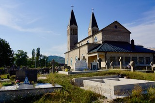

* 20:00: [Svadbeni salon Rustikana](https://www.facebook.com/pg/Rustikana-Svadbeni-Salon-151493608260287/about/?ref=page_internal), Podhum Livno, 80101, BiH

__09.06.2019.__

* Chilling at Dolores' place in [Batinića Brdo](https://goo.gl/maps/wY7uqdbcUWA2) 

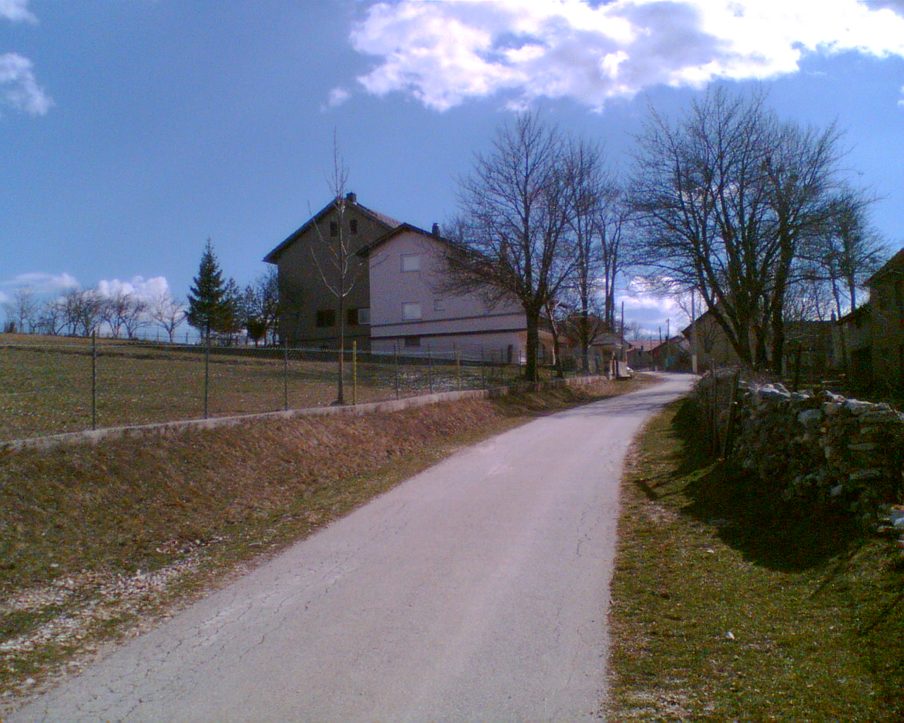 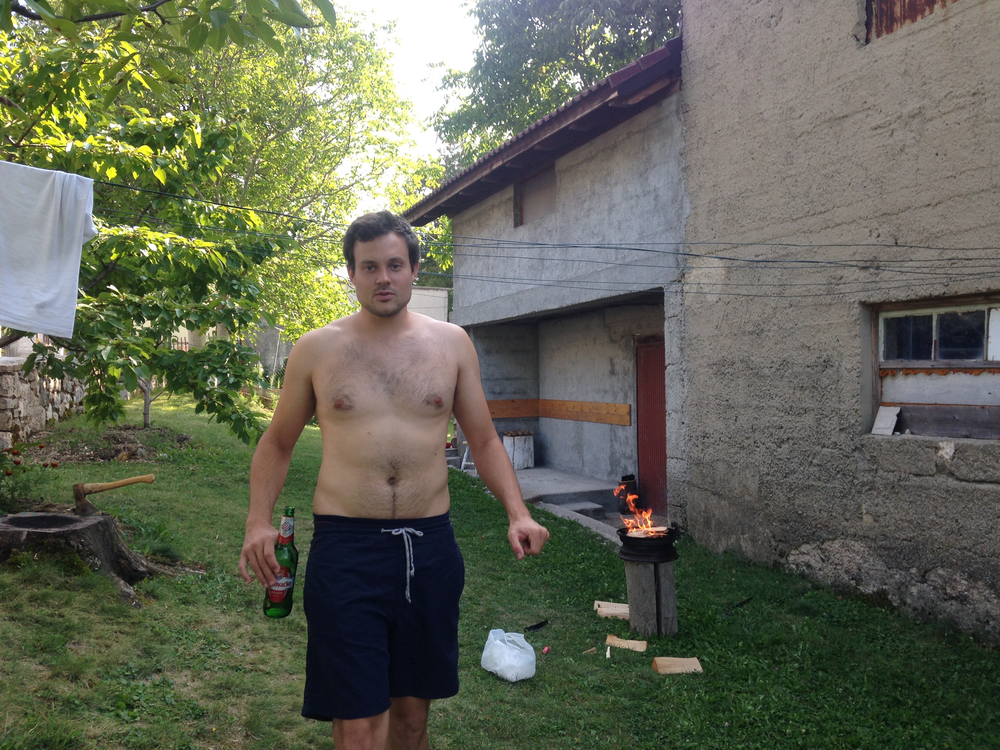

How to arrive to Podhum
---------------------

* Having a car/renting a car at the Split Airport is the best option, since the public transport is not well organised. If you want to go anyplace else than the hotel, a car is a must in Bosnia & Herzegowina.
Renting a car in Split is not expensive, but there are some additional fees for crossing the border with Bosnia & Herzegowina.

* From [Split Airport with a rented car](https://goo.gl/maps/a4NuYBwwwAp).

* From Split Airport with no car: contact us for picking you up.

* You can also arrive with the [bus](https://getbybus.com/en/bus-zurich-to-livno), but we do not recommend if you are only staying for a weekend (it takes forever)

* You can check other lines here: [rome2rio](https://www.rome2rio.com/de/s/Z%C3%BCrich/Livno)

Where to sleep
---------------------

* [NK Kamešnica](https://www.google.ch/maps/dir/Svadbeni+salon+Rustikana,+Podhum+bb,+Podhum,+Bosnia+ed+Erzegovina/43.7108991,16.9851882/@43.7155643,16.983115,2297m/data=!3m2!1e3!4b1!4m9!4m8!1m5!1m1!1s0x134acb587391b669:0x4a96362c54dc4279!2m2!1d16.9989459!2d43.7196087!1m0!3e2): local football club place, near the restaurant, 10 EUR a night (per person). It has about 42 beds (mostly 3-bed rooms). No gastro service included, but breakfast can be arranged with the restaurant Rustikana. If you want to stay near the wedding restaurant, this is the best option. We already reserved all the rooms, so contact us if you want to stay here. 
* In Livno (town):
	* [B&M](https://www.booking.com/hotel/ba/b-m-livno.en-gb.html?aid=389184;label=metagha-link-mapresultsDE-hotel-2405203_dev-desktop_los-1_bw-17_dow-Tuesday_defdate-1_room-0_lang-en_curr-EUR_gstadt-2_rateid-0_aud-102523974_cid-67;sid=385b6669b77ac3210ae5d051a33fa41c;all_sr_blocks=240520301_102247697_0_1_0;checkin=2018-09-25;checkout=2018-09-26;dest_id=-87179;dest_type=city;dist=0;group_adults=2;hapos=1;highlighted_blocks=240520301_102247697_0_1_0;hpos=1;room1=A%2CA;sb_price_type=total;srepoch=1536415085;srfid=741201b973af4ac9ec3924df7d2e1864c8cdedeeX1;srpvid=e5686236cb930254;type=total;ucfs=1&#hotelTmpl): modern
	* [Hotel park](https://www.booking.com/hotel/ba/park-livno.en-gb.html?aid=389184&label=metagha-link-mapresultsDE-hotel-2405203_dev-desktop_los-1_bw-17_dow-Tuesday_defdate-1_room-0_lang-en_curr-EUR_gstadt-2_rateid-0_aud-102523974_cid-67&sid=385b6669b77ac3210ae5d051a33fa41c&checkin=2018-09-25&checkout=2018-09-26&ucfs=1&srpvid=7a62624f83980088&srepoch=1536415136&highlighted_blocks=38083504_112503334_0_1_0&all_sr_blocks=38083504_112503334_0_1_0&room1=A,A&hpos=2&hapos=2&dest_type=city&dest_id=-87179&srfid=083f09458ea628c4fc9a2deca9ad5fd6e4b52fabX2&from=searchresults;highlight_room=#hotelTmpl): good food, nice park, a little bit old-fashion but ok
	* [Hard Rock Hotel](https://www.booking.com/hotel/ba/hard-rock-rooms-for-two.en-gb.html?aid=389184&label=metagha-link-mapresultsDE-hotel-2405203_dev-desktop_los-1_bw-17_dow-Tuesday_defdate-1_room-0_lang-en_curr-EUR_gstadt-2_rateid-0_aud-102523974_cid-67&sid=385b6669b77ac3210ae5d051a33fa41c&checkin=2018-09-25&checkout=2018-09-26&ucfs=1&srpvid=0f57625af9d000d4&srepoch=1536415157&highlighted_blocks=331601802_117238032_2_0_0&all_sr_blocks=331601802_117238032_2_0_0&room1=A,A&hpos=4&hapos=4&dest_type=city&dest_id=-87179&srfid=014e960999d81ce3adae730eda5f834905af7ddcX4&from=searchresults;from_hc_img=1#hotelTmpl): it looks nice, in the old town, but we haven't checked here to know for sure.
* contact us if you have problems finding an accommodation

What to do if you stay longer
---------------------

* Stari grad [Livno](http://www.bhtourism.ba/eng/livno.wbsp)

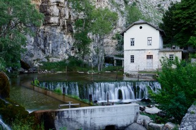
* Tušnica hiking

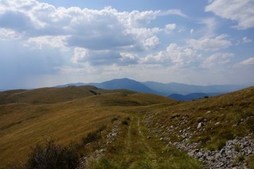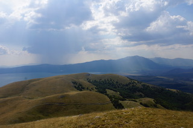

* Lake Mandek

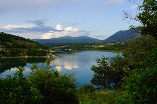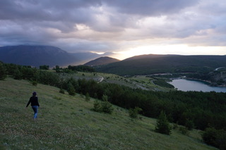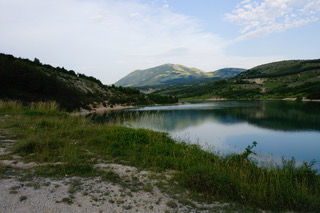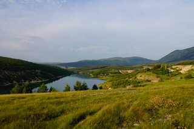

* [Imotski](https://visitimota.com/) lakes: 1h

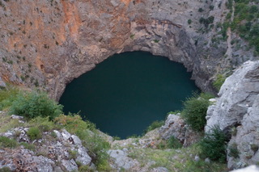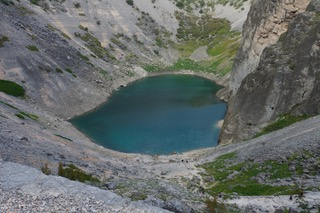

* [Kamešnica hiking](https://www.summitpost.org/kamesnica/152350)
* Looking for wild horses in [Kruzi](http://www.balkaninsight.com/en/article/herzegovina-herd-of-wild-horses-near-livno)
* Nearest bigger cities: Split 1.5h, Mostar 2.5h, Sarajevo 3.5h by car
* Nearest town at the Adriatic sea: [Makarska](https://www.makarskainfo.com/), 1.15 h by car

Contact
---------------------

* Adrian: [adilemmenmeier@hotmail.com](mailto:adilemmenmeier@hotmail.com), +41 78 884 54 14
* Dolores: [batinic.dolores@gmail.com](mailto:batinic.dolores@gmail.com), +49 176 301 553 72

